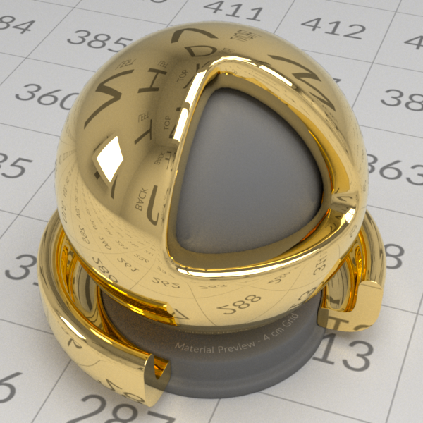

# StandardShaderBall for Mitsuba

[StandardShaderBall](https://github.com/usd-wg/assets/tree/main/full_assets/StandardShaderBall) exported for Mitsuba, including materials from [Physically Based](https://github.com/AntonPalmqvist/physically-based-api), and standard illuminants from [Colour](https://github.com/colour-science/colour/blob/develop/colour/colorimetry/datasets/illuminants/sds.py).
Configured for spectral rendering.

## How to use

### Via Command Line

1. Install Mitsuba, for example via PyPI with `pip install mitsuba`
2. Run `mitsuba ShaderBall.xml -Dmaterial="glass" -Dspp=64 -o render.exr`
   - Variables available for use with the -D flag:
     - `material` Full list of available materials can be found under [StandardShaderBall/materials](materials) (default `"gold"`)
     - `illuminant` Full list of available illuminants can be found under [StandardShaderBall/illuminants](illuminants) (default `"d65"`)
     - `integrator` Choose between "path" or "volpath" depending on if the material needs to render effects such as absorption (default `"path"`)
     - `spp` Samples Per Pixel (default `64`)
     - `max_depth` Specifies the longest path depth (default `32`)
     - `resx` X resolution of the rendered image (default `600`)
     - `resy` Y resolution of the rendered image (default `600`)

### Via Python Script

Your Python environment can be set up as you like, but here's a guide for [UV](https://docs.astral.sh/uv/):
1. Install uv from https://docs.astral.sh/uv/#installation
2. Create virtual environment `uv venv`
3. Activate virtual environment: `source .venv/bin/activate`
4. Install Mitsuba `uv pip install mitsuba`
5. Run `uv run render.py`
   - Variables can be set in [StandardShaderBall.xml](StandardShaderBall.xml)

# License

[StandardShaderBall](https://github.com/usd-wg/assets/tree/main/full_assets/StandardShaderBall) [![CC BY 4.0][cc-by-shield]][cc-by]
[Physically Based](https://github.com/AntonPalmqvist/physically-based-api) 
[Colour](https://github.com/colour-science/colour/blob/develop/colour/colorimetry/datasets/illuminants/sds.py) 

[cc-by]: http://creativecommons.org/licenses/by/4.0/
[cc-by-shield]: https://img.shields.io/badge/License-CC%20BY%204.0-lightgrey.svg